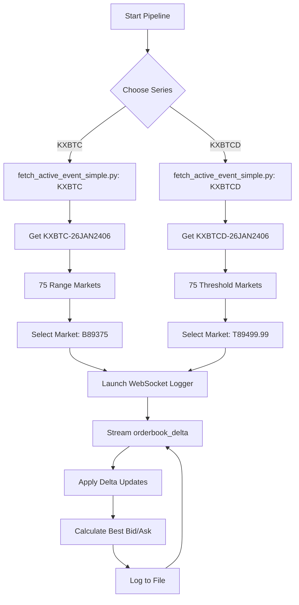

# 🎯 Complete Pipeline - KXBTC & KXBTCD Series

## ✅ Both Series Working with Live Bid/Ask Logging

---

## 📊 Series Comparison

### **KXBTC** (Hourly Bitcoin Price Ranges)
- **Type:** Range markets (e.g., $89,250 to $89,499.99)
- **Active Event:** KXBTC-26JAN2406
- **Title:** Bitcoin price range on Jan 24, 2026 at 6am EST?
- **Markets:** 75 total
- **Example Market:** KXBTC-26JAN2406-B89375

### **KXBTCD** (Daily Bitcoin Price Thresholds)
- **Type:** Threshold markets (e.g., $89,500 or above)
- **Active Event:** KXBTCD-26JAN2406
- **Title:** Bitcoin price on Jan 24, 2026 at 6am EST?
- **Markets:** 75 total
- **Example Market:** KXBTCD-26JAN2406-T89499.99

---

## 💰 Current Live Bid/Ask Data

### **KXBTC-26JAN2406-B89375** ($89,250-$89,499.99 Range)

```
╔═══════════════════════════════════════════════════════════╗
║  Market: $89,250 to $89,499.99 (RANGE)                    ║
╠═══════════════════════════════════════════════════════════╣
║  YES = Bitcoin will be in this range                      ║
║    Best Bid:  56¢  (buy YES)                              ║
║    Best Ask:  71¢  (sell YES)                             ║
║    Spread:    15¢                                         ║
║                                                           ║
║  NO = Bitcoin will NOT be in this range                   ║
║    Best Bid:  29¢  (buy NO)                               ║
║    Best Ask:  44¢  (sell NO)                              ║
║    Spread:    15¢                                         ║
╚═══════════════════════════════════════════════════════════╝
```

**WebSocket Live Updates:**
```
2026-01-24 05:34:31.258  yes_buy=57¢  yes_sell=71¢  no_buy=29¢  no_sell=43¢
2026-01-24 05:34:32.779  yes_buy=51¢  yes_sell=71¢  no_buy=29¢  no_sell=49¢
2026-01-24 05:34:33.301  yes_buy=57¢  yes_sell=71¢  no_buy=29¢  no_sell=43¢
```

---

### **KXBTCD-26JAN2406-T89499.99** ($89,500 or Above Threshold)

```
╔═══════════════════════════════════════════════════════════╗
║  Market: $89,500 or above (THRESHOLD)                     ║
╠═══════════════════════════════════════════════════════════╣
║  YES = Bitcoin will be >= $89,500                         ║
║    Best Bid:  42¢  (buy YES)                              ║
║    Best Ask:  44¢  (sell YES)                             ║
║    Spread:    2¢                                          ║
║                                                           ║
║  NO = Bitcoin will be < $89,500                           ║
║    Best Bid:  56¢  (buy NO)                               ║
║    Best Ask:  58¢  (sell NO)                              ║
║    Spread:    2¢                                          ║
╚═══════════════════════════════════════════════════════════╝
```

**WebSocket Live Updates:**
```
2026-01-24 05:39:03.187  yes_buy=41¢  yes_sell=43¢  no_buy=57¢  no_sell=59¢
2026-01-24 05:39:04.215  yes_buy=42¢  yes_sell=43¢  no_buy=57¢  no_sell=58¢
2026-01-24 05:39:07.469  yes_buy=42¢  yes_sell=43¢  no_buy=57¢  no_sell=58¢
```

---

## 🚀 Usage - Both Series

### **KXBTC** (Range Markets)

```bash
# Log specific range ($89,250-$89,499.99)
python3 start_event_logging.py --series KXBTC --single "89,250"

# Log all 75 range markets
python3 start_event_logging.py --series KXBTC

# Watch live
tail -f logs_kxbtc-26jan2406/kxbtc-26jan2406-b89375.log
```

### **KXBTCD** (Threshold Markets)

```bash
# Log specific threshold ($89,500 or above)
python3 start_event_logging.py --series KXBTCD --single "89,500"

# Log all 75 threshold markets
python3 start_event_logging.py --series KXBTCD

# Watch live
tail -f logs_kxbtcd-26jan2406/kxbtcd-26jan2406-t89499.99.log
```

---

## 📁 Output Structure

```
KalshiBlockchain/
├── logs_kxbtc-26jan2406/          # KXBTC Range markets
│   ├── kxbtc-26jan2406-b89375.log  ($89,250-$89,499.99)
│   ├── kxbtc-26jan2406-b89625.log  ($89,500-$89,749.99)
│   └── ... (75 markets total)
│
├── logs_kxbtcd-26jan2406/          # KXBTCD Threshold markets
│   ├── kxbtcd-26jan2406-t89499.99.log  ($89,500 or above)
│   ├── kxbtcd-26jan2406-t89749.99.log  ($89,750 or above)
│   └── ... (75 markets total)
```

---

## 🔍 Key Differences

| Feature | KXBTC | KXBTCD |
|---------|-------|--------|
| **Market Type** | Range (Between X and Y) | Threshold (Above/Below X) |
| **Example** | $89,250 to $89,499.99 | $89,500 or above |
| **Ticker Format** | KXBTC-DATE-**B**XXXXX | KXBTCD-DATE-**T**XXXXX.99 |
| **Typical Spread** | 10-15¢ (wider) | 1-3¢ (tighter) |
| **Liquidity** | Lower (specific ranges) | Higher (broader outcomes) |
| **Use Case** | Precise price bets | Directional bets |

---

## 📈 Market Interpretation

### KXBTC Example: $89,250-$89,499.99
- **YES @ 56¢**: Market thinks 56% chance Bitcoin lands in this specific range
- **NO @ 29¢**: 29% chance Bitcoin is outside this range (too low or too high)
- **Gap**: 15¢ spread reflects lower liquidity

### KXBTCD Example: $89,500 or above
- **YES @ 42¢**: Market thinks 42% chance Bitcoin >= $89,500
- **NO @ 56¢**: 56% chance Bitcoin < $89,500
- **Gap**: 2¢ spread reflects better liquidity

---

## 🎬 Complete Workflow - Both Series



---

## ✨ Success Metrics

### KXBTC Series
- ✅ Active Event: KXBTC-26JAN2406
- ✅ Example Market: $89,250-$89,499.99 (B89375)
- ✅ Live Bid/Ask: 56¢/71¢ (YES), 29¢/44¢ (NO)
- ✅ WebSocket logging: Working perfectly
- ✅ Ready for all 75 markets

### KXBTCD Series
- ✅ Active Event: KXBTCD-26JAN2406
- ✅ Example Market: $89,500 or above (T89499.99)
- ✅ Live Bid/Ask: 42¢/44¢ (YES), 56¢/58¢ (NO)
- ✅ WebSocket logging: Working perfectly
- ✅ Ready for all 75 markets

---

## 🔧 The Fix Applied to Both Series

The same delta-based fix works for both:

```python
# Fixed code (works for KXBTC AND KXBTCD):
delta = msg.get("delta")           # Correct field from Kalshi
new_qty = current_qty + delta      # Apply incremental update
if new_qty <= 0:
    remove_level()                 # Remove when quantity depleted
else:
    update_or_add_level(new_qty)  # Add or update level
```

---

## 🛑 Stop All Loggers (Both Series)

```bash
pkill -f 'log_one_ticker.py'
```

---

## 📝 Quick Reference

### Fetch Active Events
```python
from fetch_active_event_simple import get_active_event_for_series

# KXBTC (hourly ranges)
kxbtc_event = get_active_event_for_series('KXBTC')

# KXBTCD (daily thresholds)
kxbtcd_event = get_active_event_for_series('KXBTCD')
```

### Start Logging
```bash
# KXBTC: $89,250-$89,499.99
python3 start_event_logging.py --series KXBTC --single "89,250"

# KXBTCD: $89,500 or above
python3 start_event_logging.py --series KXBTCD --single "89,500"
```

---

**🎉 Both KXBTC and KXBTCD series are production-ready!**
