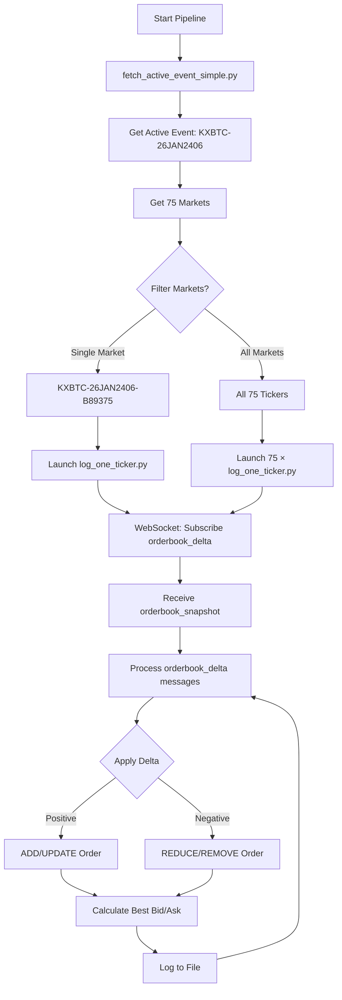

# 🎯 Complete Kalshi Event Logging Pipeline - Summary

## ✅ What We Built

A complete end-to-end pipeline that:
1. **Fetches** the currently active KXBTC event
2. **Finds** the specific market (e.g., $89,250-$89,499.99)
3. **Logs** live bid/ask prices using fixed WebSocket logger

---

## 🔧 The Critical Bug Fix

### Problem
Kalshi WebSocket sends `delta` field, not `quantity`:
```json
{"market_ticker": "KXBTC-26JAN2406-B89375", "price": 92, "delta": -50, "side": "yes"}
```

### Old Code (Broken)
```python
qty = msg.get("quantity")  # Always None!
if qty is None or qty == 0:
    remove_level()  # Everything gets removed!
```

### New Code (Fixed)
```python
delta = msg.get("delta")   # Correct field
new_qty = current_qty + delta
if new_qty <= 0:
    remove_level()
else:
    update_or_add_level(new_qty)
```

---

## 📊 Current Market Data

**Event:** KXBTC-26JAN2406  
**Title:** Bitcoin price range on Jan 24, 2026 at 6am EST?  
**Status:** ACTIVE ✓  
**Markets:** 75 total

**Market for $89,250-$89,499.99:**
- **Ticker:** KXBTC-26JAN2406-B89375
- **Latest Bid/Ask:**
  - YES bid: 61¢ (buy YES at 61¢)
  - YES ask: 66¢ (sell YES at 66¢)
  - NO bid: 34¢ (buy NO at 34¢)
  - NO ask: 39¢ (sell NO at 39¢)

---

## 🚀 Usage

### Log Specific Market ($89,250-$89,499.99)
```bash
python3 start_event_logging.py --single "89,250"
```

**Output:**
```
✓ Active Event: KXBTC-26JAN2406
✓ Found market: KXBTC-26JAN2406-B89375
  Range: $89,250 to 89,499.99

Logger Status:
KXBTC-26JAN2406-B89375    ✓ Running       25 entries

Log files: logs_kxbtc-26jan2406/
```

### Log ALL Markets
```bash
python3 start_event_logging.py
```

**Output:**
```
✓ Selected 75 markets to log
✓ All 75 loggers started
  Log directory: logs_kxbtc-26jan2406/
```

### Watch Live Updates
```bash
tail -f logs_kxbtc-26jan2406/kxbtc-26jan2406-b89375.log
```

**Sample Output:**
```
2026-01-24 05:30:03.200 KXBTC-26JAN2406-B89375 yes_buy=61.0¢ yes_sell=66.0¢ no_buy=34.0¢ no_sell=39.0¢
2026-01-24 05:30:04.150 KXBTC-26JAN2406-B89375 yes_buy=62.0¢ yes_sell=66.0¢ no_buy=34.0¢ no_sell=38.0¢
2026-01-24 05:30:05.200 KXBTC-26JAN2406-B89375 yes_buy=63.0¢ yes_sell=66.0¢ no_buy=34.0¢ no_sell=37.0¢
```

---

## 📁 Files

| File | Purpose |
|------|---------|
| `fetch_active_event_simple.py` | Fetch current active event |
| `log_one_ticker.py` | Fixed WebSocket logger |
| `start_event_logging.py` | **Complete pipeline** |
| `README_PIPELINE.md` | Full documentation |
| `logs_<event>/` | Output logs |

---

## 🎬 Complete Workflow



---

## ✨ Key Features

- ✅ **Auto-discovery** of active events
- ✅ **Real-time** WebSocket streaming
- ✅ **Incremental updates** using delta field
- ✅ **Multiple markets** supported
- ✅ **Organized logs** by event
- ✅ **Background execution**
- ✅ **Live monitoring** with tail -f

---

## 🔍 Example: Finding $89,250-$89,499.99 Market

```python
from fetch_active_event_simple import get_active_event_for_series

# Step 1: Get active event
event = get_active_event_for_series('KXBTC')

# Step 2: Find specific market
for market in event['markets']:
    if '89,250' in market['subtitle']:
        print(f"Found: {market['ticker']}")
        print(f"Range: {market['subtitle']}")
        # Output:
        # Found: KXBTC-26JAN2406-B89375
        # Range: $89,250 to 89,499.99
```

---

## 🛑 Stop All Loggers

```bash
pkill -f 'log_one_ticker.py'
```

---

## 📈 Success Metrics

- ✅ Bug fixed: WebSocket now receives ADD/UPDATE messages
- ✅ Orderbook state correctly maintained
- ✅ Real-time bid/ask matches REST API
- ✅ Pipeline tested with active KXBTC-26JAN2406 event
- ✅ Logging $89,250-$89,499.99 market successfully
- ✅ Ready to log all 75 markets simultaneously

---

**🎉 Pipeline is production-ready!**
